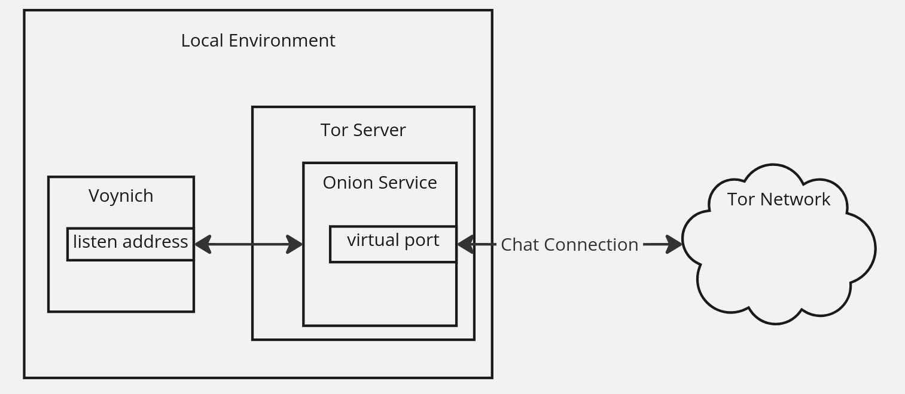
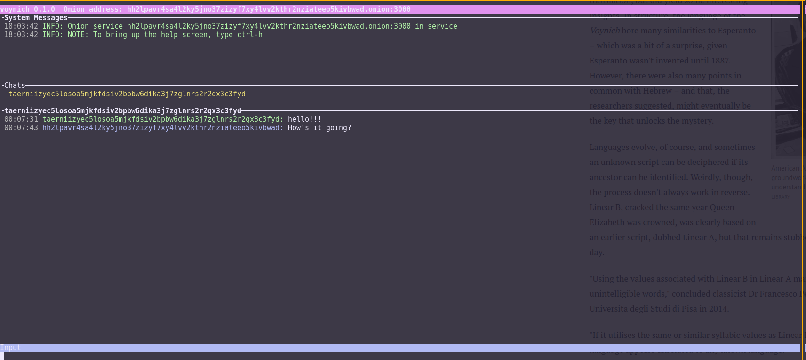

# Voynich

**Library for creating anonymous, end-to-end encrypted and authenticated chat applications**

Voynich is a Rust library for creating chat applications which are anonymous, end-to-end encrypted and authenticated. It includes an example terminal chat application, `voynich-term`. It uses [Tor onion services](https://community.torproject.org/onion-services/overview/) for anonymity, and for the outer layer of encryption; in addition, each message is encrypted and authenticated using ephemeral session keys, signed using the onion service secret key.

Voynich uses the identifier of the onion service as your identity as a chat participant - the onion service _is_ your identity. It can generate new onion services on-the-fly, either transient (existing only for the life of the chat session) or persistent (reusing the same onion service in multiple sessions), and since the IP address of a given onion service is hidden, your identity is hidden as well.

In addition to using onion services for anonymity (not to mention basic, TLS-level encryption), Voynich additionally encrypts and authenticates each message using a session key regenerated for each session.

***NOTE: The cryptographic code hasn't been audited by anyone but myself - use at your own risk!!!***

## Overview

I started this project because I was wondering if it was possible to have a completely anonymous, encrypted, authenticated messaging system. As such, it's really more of a proof-of-concept than a full-featured chat system.

Voynich uses the [tor-client-lib](https://crates.io/crates/tor-client-lib) library to interact with the Tor server running locally, allowing it to either use existing onion services configured within the Tor server, or to create onion services on-the-fly. The ID of the onion service (the part of the onion hostname before the ".onion") serves as the identity of each chat participant. Since the onion service ID can't, in theory, be connected to a particular IP address, it provides anonymity; however, since the session encryption key is linked with the onion service ID via the private key, it also provides authentication - you know that when you connect to a given onion service, whoever you're talking to has access to the private key for the service.

Because you can create the onion services as either persistent services (created by Voynich, and reused in subsequent chat sessions), or transient (created by Voynich on startup and lasting only for the length of the chat session), you can think of it as supporting longer-term or transient identities, which can be useful in a few different contexts:

- Alice and Bob are both using persistent onion services, and have informed each other (out of band) about the identity of their onion services. As such Alice and Bob will both know who the other is, but nobody outside the two of them will know, or will be able to determine, their identities.
- Alice and Bob don't know each other, but want to conduct some sort of transaction between themselves anonymously. They each create transient onion services on startup, and exchange their IDs through some sort of anonymous out-of-band method (presumably via whatever communication channel they used to determine that they want to pursue the transaction). They can then communicate completely anonymously - if Bob (or a third party) decides he wants to find out Alice's identity, he would have to essentially break the Tor anonymity model, which would be difficult (but not [impossible](https://en.wikipedia.org/wiki/Tor_(network)#Weaknesses)).

### Features

The checked features are currently implemented; the unchecked are expected in future versions.

- [x] Multiple single-user chat sessions
- [ ] Multi-chat - a chat session between multiple users
- [x] A configuration object serializable as TOML
- [x] Ability to save persistent onion services between sessions
- [ ] Contact list which (potentially) maps onion services to nicknames
- [ ] Authorized users/keys list a la SSH

### Bugs and Additional Features

As mentioned, this is really more of a proof-of-concept, than a full-featured application library (at least at this point). That being said, I'm open to any of the following:

- Feature requests or bug reports via Github issues
- PRs to add features or fix bugs

I'm especially hopeful that someone with more cryptographic experience than I is willing to look over the cryptographic setup (more below) and code, and offer suggestions as to improvements.

### Cryptographic Details

Voynich generates session keys via [ECDH](https://en.wikipedia.org/wiki/Elliptic-curve_Diffie%E2%80%93Hellman), and then authenticated using the secret key of the onion service. Specifically, when Alice connects to Bob's onion service using Voynich:

- Key Exchange:
  - Alice and Bob each create an ephemeral public/private x25519 key pair
  - Alice sends her ephemeral public key to Bob; Bob sends his to Alice
  - Both generate a shared secret based on their ephemeral private key and the other's public key
  - A shared symmetric key is generated from the shared secret by both using an [HKDF](https://en.wikipedia.org/wiki/HKDF) to expand the secret

- Encryption:
  - Each message struct is serialized, and the serialized data is expanded to a full block size of the cipher by filling with random data. The resulting blocks are encrypted and sent as the encrypted message.

- Authentication:
  - Before chat messages are exchanged, both users authenticate. A session hash is generated by hashing the concatenation of:
    - Alice's onion service ID
    - Bob's onion service ID
    - Alice's onion service public key
    - Bob's onion service public key
    - The shared secret

  - Alice and Bob then append each of their service IDs to that hash, and sign the result using their onion service private key, and exchange their service IDs and the signature
  - They each then go about validating the signature using the public key of the other

Once the validation is successful, they start their session, encrypting each packet as above.

Note that a given symmetric key is never reused in a different session. Key rotation during a session could also be accomplished by redoing the key exchange at various times during the session.

## voynich-term

There's also a terminal-based chat app included, called `voynich-term`, mostly as an example, using [ratatui](https://crates.io/crates/ratatui) for the terminal UI code. A word of warning: I'm not, by any stretch of the imagination, a good, or even decent, UI designer. Suggestions and PRs for improving the UI will be happily accepted!

For more information, see [the voynich-term README](./src/voynich-term/README.md).
