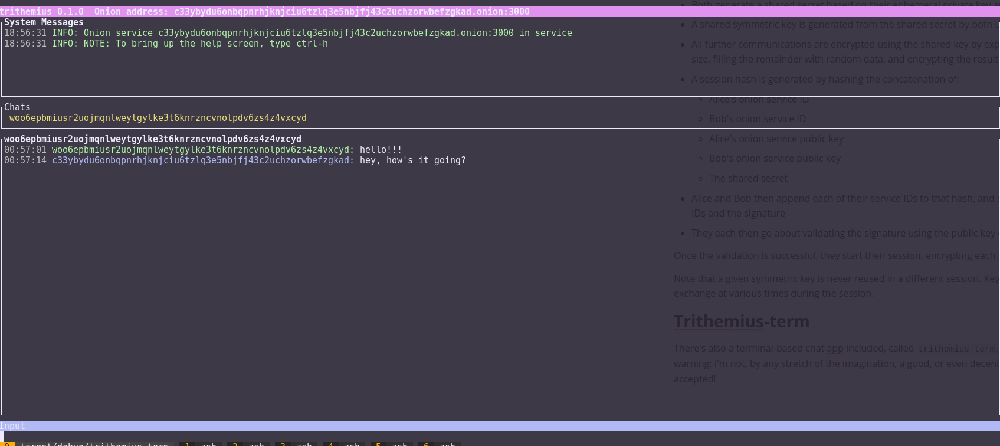

# Trithemius

**Library for creating anonymous, end-to-end encrypted and authenticated chat applications**

Trithemius is a Rust library for creating chat applications which are anonymous, end-to-end encrypted and authenticated, along with a (very simple) terminal application as an example application. It uses [Tor onion services](https://community.torproject.org/onion-services/overview/) for anonymity, and for the outer layer of encryption; in addition, each message is encrypted using a [ChaCha20-Poly1305](https://en.wikipedia.org/wiki/ChaCha20-Poly1305) session key derived from ephemeral public/private keypairs, and verified using the public/private keypairs associated with each onion service.

***NOTE: The cryptographic code hasn't been audited by anyone but myself - use at your own risk!!!***

## Overview

Trithemius uses the [tor-client-lib](https://crates.io/crates/tor-client-lib) library to interact with the Tor server running locally, allowing it to either use existing onion services configured within the Tor server, or to create onion services on-the-fly. The ID of the onion service (the part of the onion hostname before the ".onion") serves as the identity of each chat participant. Since the onion service ID can't, in theory, be connected to a particular IP address, it provides anonymity; however, since the session encryption key is linked with the onion service ID via the private key, it also provides authentication - you know that when you connect to a given onion service, whoever you're talking to has access to the private key for the service.

Because you can create the onion services as either long-term services (i.e., added to the configuration of the Tor server you're running), or transient (created by Trithemius on startup and lasting only for the length of the chat session), you can think of it as supporting longer-term or transient identities, which can be useful in a few different contexts:

- Alice and Bob are both running long-term onion services, and have informed each other (out of band) about the identity of their onion services. As such Alice and Bob will both know who the other is, but nobody outside the two of them will know, or will be able to determine, their identities.
- Alice and Bob don't know each other, but want to conduct some sort of transaction between themselves anonymously. They each create transient onion services on startup, and exchange their IDs through some sort of anonymous out-of-band method (presumably via whatever communication channel they used to determine that they want to pursue the transaction). They can then communicate completely anonymously - if Bob (or a third party) decides he wants to find out Alice's identity, he would have to essentially break the Tor anonymity model, which would be difficult (but not [impossible](https://en.wikipedia.org/wiki/Tor_(network)#Weaknesses)).

### Cryptographic Details

Trithemius uses the private keys associated with the Tor onion services involved in a conversation to generate session keys via [ECDH](https://en.wikipedia.org/wiki/Elliptic-curve_Diffie%E2%80%93Hellman). Specifically, when Alice connects to Bob's onion service using Trithemius:

- Alice and Bob each create an ephemeral public/private key pair
- Alice sends her ephemeral public key to Bob; Bob sends his to Alice
- Both generate a shared secret based on their ephemeral private key and the other's public key
- A shared symmetric key is generated from the shared secret by both using an [HKDF](https://en.wikipedia.org/wiki/HKDF) to expand the secret
- All further communications are encrypted using the shared key by expanding the serialized message struct to a full integral of the encryption block size, filling the remainder with random data, and encrypting the result.
- A session hash is generated by hashing the concatenation of:
  - Alice's onion service ID
  - Bob's onion service ID
  - Alice's onion service public key
  - Bob's onion service public key
  - The shared secret
- Alice and Bob then append each of their service IDs to that hash, and sign the result using their onion service private key, and exchange their service IDs and the signature
- They each then go about validating the signature using the public key of the other

Once the validation is successful, they start their session, encrypting each packet as above.

Note that a given symmetric key is never reused in a different session. Key rotation during a session could also be accomplished by redoing the key exchange at various times during the session.

## Trithemius-term

There's also a terminal-based chat app included, called `trithemius-term`, mostly as an example, using [ratatui](https://crates.io/crates/ratatui) for the terminal UI code. A word of warning: I'm not, by any stretch of the imagination, a good, or even decent, UI designer. Suggestions and PRs for improving the UI will be happily accepted!
